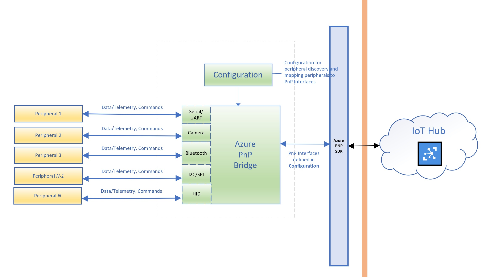

# Azure PnP Bridge

## Introduction
Azure PnP Bridge is the open source effort from Microsoft to bridge PC Device PnP with Azure IoT PnP in order to make it easy for device developers to easily connect many PC peripherals to Azure in order to easily enable remote managing and monitoring peripherals and PC gateways at scale.  Azure PnP Bridge also make it easy to perform analytics on edge as well as moving data to Azure in order to perform analytics in the cloud.  

Azure PnP Bridge is a standalone executable that developers can drop onto their PC/IoT Gateway devices, with simple configuration, this service can bridge the device PnP with Azure PnP and send telemetry and event data to Azure Cloud.  Developers continue leveraging existing Device Provisioning and Azure Cloud services.  

Azure PnP Bridge is created by the Microsoft Core OS team that owns sensors, buses and connectivities with decades of drivers, platform and developer API experience.  

Support on Linux will come in the near future.    

## Pre-Requisite

#### Operating System Requirement

- Windows:
  - OS version 1809 or newer is required.
  - For Camera monitoring functionality, current Insider Preview OS version is required.
  - One of the following OS flavors:
    - Windows IoT Enterprise
    - Windows Server
    - Windows Desktop SKU
    - Windows IoT Core (if no camera monitoring is needed)

- Linux - Coming In Future.

- Hardware:
  - Any hardware capable supporting above OS SKUs and versions.
  - Supported peripherals, please refer to section below.

- Private Preview of Azure IoT Central at https://aka.ms/iotc-demo.

## Azure PnP Bridge Architecture

## Dev Machine Setup

### Development Pre-Requisite
- In order to build Private Preview Azure PnP Bridge, you need to have access to Azure IoT PnP Preview at https://github.com/azure/azure-iot-pnp-preview. 

- Ensure cmake and Visual Studio 2017 are installed

- Download Windows 17763 SDK: https://developer.microsoft.com/en-US/windows/downloads/windows-10-sdk

### Build Azure PnP Bridge
  After clone Azure PnP Bridge repo, run following commands in "Developer Command Prompt for VS 2017":
  - cd PnpBridge
  - git submodule update --init --recursive 
  - cd Scripts
  - build.prereq.cmd
  - Open PnpBridge\src\PnpBridge\PnpBridge.vcxproj with "Visual Studio 2017"
  - Ensure build target is set to Release|Debug and x86|x64 matches to the build.prereq.cmd's build and build the solution
  - Pnpbridge.exe is the Azure PnP Bridge binary

### Supported Peripherals

Azure PnP Bridge comes with set of supported peripherals:
- Peripherals connected over Serial COM ports or Serial over USB
    - Please refer ./SerialPnP/Readme.md programming guide on how to enable Azure PNP Interfaces
    - Peripherals connected HID over USB
- All cameras supported by Windows OS (Webcam, MIPI cameras and IP of RGB/IR/Depth cameras).
  - Windows: https://techcommunity.microsoft.com/t5/Camera-Platform-and-Experiences/ct-p/MicrosoftCamera 
- I2C (Coming soon)
  - Windows: https://docs.microsoft.com/en-us/uwp/api/Windows.Devices.I2c

For serial/USB peripheral devices that are not included in current source code, developers can update the Azure PnP Bridge code to enable their custom protocols.

### Deploy Azure PnP Bridge

1. Set up an IoT Central Dashboard
  - https://docs.microsoft.com/en-us/azure/iot-central/tutorial-define-device-type 

2. Setup a device and get the Connection String to connect the device to IoT Central.  This device is the Azure PnP Bridge Device. 
  - https://docs.microsoft.com/en-us/azure/iot-central/tutorial-add-device

3. Setup Azure PnP Bridge Device
    - Refer to "Re-Requisite" section for choosing OS image to install on the device. 
    - Update src/pnpbridge/config.json "ConnectionString" under "PnpBridgeParameters" with the step #2 Connection String for the device.    
    - copy pnpbridge.exe and src/pnpbridge/config.json in the same location on the Azure PnP Bridge Device.
    - In a command line window, type "pnpbridge.exe".  This will start Azure PnP Bridge process.  

## Contributing
This project welcomes contributions and suggestions. Most contributions require you to agree to a Contributor License Agreement (CLA) declaring that you have the right to, and actually do, grant us the rights to use your contribution. For details, visit https://cla.microsoft.com.
When you submit a pull request, a CLA-bot will automatically determine whether you need to provide a CLA and decorate the PR appropriately (e.g., label, comment). Simply follow the instructions provided by the bot. You will only need to do this once across all repos using our CLA.
This project has adopted the Microsoft Open Source Code of Conduct. For more information see the Code of Conduct FAQ or contact opencode@microsoft.com with any additional questions or comments.