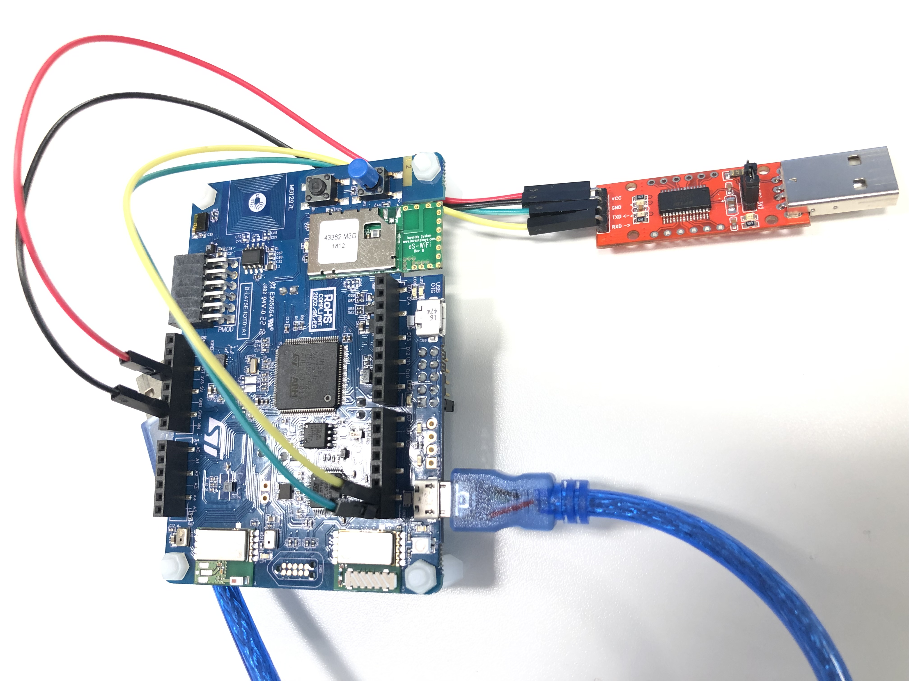

# Connect STM32 Discovery Kit to Azure using PnP Bridge

## Prerequisites
#### Software
* Install STM32CubeMX to configure STM32 MCU and generate IAR projec: https://www.st.com/en/development-tools/stm32cubemx.html
* Install IAR Embeded Workbench, the development IDE: https://www.iar.com/iar-embedded-workbench/
* Follow [PnPBridge\Readme.md](../../PnpBridge/ReadMe.md) to build and deploy the PnP Bridge.

#### Hardware
* STM32 Discovery Kit: https://www.st.com/content/st_com/en/products/evaluation-tools/product-evaluation-tools/mcu-mpu-eval-tools/stm32-mcu-mpu-eval-tools/stm32-discovery-kits/b-l475e-iot01a.html
* A RS232-to-USB Module

#### Schematics
Connect the STM32 Discovery Kit to RS232-to-USB Module following the description here:
* Connection the VCC and GND pins on the modules to the 3V3 and GND pins on the STM32 Discovery Kit respectively.
* Connection the UART RX and TX pins to the D1 and D0 on the STM32 Discovery Kit respectively.
* Connection the Debugging USB port (Micro USB STLINK port) to the PC
* Schematics: 

## Get started

#### Step 1: Configure MCU pinout and generate IAR project

1. Open STM32CubeMX .
2. Click 'New Project' > 'Start My project from STBoard' > 'Access to Board Selector', it might download neccessary files.
3. Search board `B-L475E-IOT01A` to create a project with this board.
4. Click `Yes` to initialize all peripherals with their default mode.
5. In `Pinout & Configuration` tab, select 'Catagories' > 'Connectivity' > 'UART4', change the configuration to:
    | Column Name | Value |
    | :-----------: | :-----------: |
    | Mode |  Asynchronous |
    | Hardware Flow Control (RS232) | Disable |
    | Hardware Flow Control (RS485) | Unchecked |

6. In `Project Manager` tab, change the configuration to:
    | Field Name | Value |
    | :-----------: | :-----------: |
    | Project Name |  `<project_name>` |
    | Project Location |  `<project_location>` |
    | Application Structure | Basic |
    | Toolchain / IDE | EWARM V8 |
    | MCU Reference | STM32L475VGTx |
    | Firmware Package Name and Version | STM32Cube FW_L4 V1.13.0 |

7. Click `GENERATE CODE` button on the right-top section

#### Step 2: Modify IAR project codes
1. Copy the folders/files and paste to your project folder as:

    | Folder/File Name | Location |
    | :-----------: | :-----------: |
    | Drivers/BSP |  `<path_to_project_root>/Drivers` |
    | Inc |  `<path_to_project_root>/Inc` |
    | Src |  `<path_to_project_root>/Src` |

    Note: The Drivers/BSP folder contains Temperature, Humidity, Atmospheric Pressure, Accelorometer, Gyroscope, Magneto sensors libraries.

2. Open the IAR project generated by STM32CubeMX. The project should be at `<project_root>/EWARM/Project.eww`.

3. In IAR project, import dependency files which are copied and pasted on the previous step:

    - To import Drivers/BSP: 
      - Right-click `Drivers` > Add > Add Group, and name it as `BSP`.
      - Right-click `BSP` > Add > Add Group, and name it as `B-L475E-IOT01`.
      - Right-click `BSP` > Add > Add Group, and name it as `Components`.
      - Right-click `B-L475E-IOT01` > Add > Add Files, when it prompt, add .c files from `<project_root>/Drivers/BSP/B-L475E-IOT01`.
        - stm32l475e_iot01.c
        - stm32l475e_iot01_accelero.c
        - stm32l475e_iot01_gyro.c
        - stm32l475e_iot01_hsensor.c
        - stm32l475e_iot01_magneto.c
        - stm32l475e_iot01_psensor.c
        - stm32l475e_iot01_tsensor.c

      - Right-click `Components` > Add > Add Files, when it prompt, add .c files from `<project_root>/Drivers/BSP/Components`.
        - hts221.c
        - lis3mdl.c
        - lps22hb.c
        - lsm6dsl.c

    - To import Src:
      - Right-click `Application/User` > Add > Add Files, when it prompt, add `SerialPnP.c`, `stm32l4xx_serial_pnp.c` files from `<project_root>/Src`.

    - To include .h files:
      - Right-click `<project>` > Options > C/C++ Compiler > Preprocessor > Additional include directories.
      - Add the include directories:
        - `$PROJ_DIR$/../Drivers/BSP/B-L475E-IOT01`
        - `$PROJ_DIR$/../Drivers/BSP/Components/hts221`
        -` $PROJ_DIR$/../Drivers/BSP/Components/lsm6dsl`
        - `$PROJ_DIR$/../Drivers/BSP/Components/lps22hb`
        - `$PROJ_DIR$/../Drivers/BSP/Components/lis3mdl`

4. In IAR project, create a new function `HAL_UART_Receive_v2` because we'd like to get the length of received data, which is not support by the `HAL_UART_Receive` function.

    1. In `<project_root>\Drivers\STM32L4xx_HAL_Driver\Inc\stm32l4xx_hal_uart.h: Line 1599`, add the following line:
        ```C
        HAL_StatusTypeDef HAL_UART_Receive_v2(UART_HandleTypeDef *huart, uint8_t *pData, uint16_t Size, uint32_t Timeout, int *dataSize);
        ```
    2. In `<project_root>\Drivers\STM32L4xx_HAL_Driver\Src\stm32l4xx_hal_uart.c: Line 1227`, add the function `HAL_UART_Receive_v2`:
        ```C
        HAL_StatusTypeDef HAL_UART_Receive_v2(UART_HandleTypeDef *huart, uint8_t *pData, uint16_t Size, uint32_t Timeout, int *dataSize)
        {
          uint16_t *tmp;
          uint16_t uhMask;
          uint32_t tickstart = 0;
          *dataSize = 0;
          /* Check that a Rx process is not already ongoing */
          if (huart->RxState == HAL_UART_STATE_READY)
          {
            if ((pData == NULL) || (Size == 0U))
            {
              return  HAL_ERROR;
            }

            /* Process Locked */
            __HAL_LOCK(huart);

            huart->ErrorCode = HAL_UART_ERROR_NONE;
            huart->RxState = HAL_UART_STATE_BUSY_RX;

            /* Init tickstart for timeout managment*/
            tickstart = HAL_GetTick();

            huart->RxXferSize  = Size;
            huart->RxXferCount = Size;

            /* Computation of UART mask to apply to RDR register */
            UART_MASK_COMPUTATION(huart);
            uhMask = huart->Mask;

            /* as long as data have to be received */
            while (huart->RxXferCount > 0U)
            {
              if (UART_WaitOnFlagUntilTimeout(huart, UART_FLAG_RXNE, RESET, tickstart, Timeout) != HAL_OK)
              {
                return HAL_TIMEOUT;
              }
              if ((huart->Init.WordLength == UART_WORDLENGTH_9B) && (huart->Init.Parity == UART_PARITY_NONE))
              {
                tmp = (uint16_t *) pData ;
                *tmp = (uint16_t)(huart->Instance->RDR & uhMask);
                (*dataSize) += 2;
                pData += 2U;
              }
              else
              {
                ++(*dataSize);
                *pData++ = (uint8_t)(huart->Instance->RDR & (uint8_t)uhMask);
              }
              huart->RxXferCount--;
            }

            /* At end of Rx process, restore huart->RxState to Ready */
            huart->RxState = HAL_UART_STATE_READY;

            /* Process Unlocked */
            __HAL_UNLOCK(huart);

            return HAL_OK;
          }
          else
          {
            return HAL_BUSY;
          }
        }
        ```
#### Step 3: Compile and Download IAR project codes to the board
1. Click `F7` or `Make` button on the menu bar to build the project.
2. Connect the board, and click `Download and Debug` button on the menu bar.

## Verification
This sample code only enables 4 descriptors: `Temperature(Telemetry)`, `Humidity(Telemetry)`, `Sending Frequency(Wriatble Property)`, and `Toggle LED(Command)`, because PnP Bridge currently only support maximun 4 descriptors. You may need to comment/uncomment the descriptors on `pnp_setup()` in `main.c` based on your own user scenario. You may use tools like Azure PnP CLI to verify the PnP capabilities.

Follow the [instruction](https://github.com/Azure/Azure-IoT-PnP-Preview/tree/master/CLI) here to setup Azure Pnp CLI

### Verify Telemetry
Verify that the telemetry data is being uploade to Azure using the CLI command:

```
az iot pnp monitor-events --hub-name [IoTHub Name] --device-id [Device Id] --interface [Interface Id]
```
    
### Verify Read-only Poperty
Verify that read-only properties reported are visible using the CLI command:
  ```
  az iot pnp list-properties --interface [Interface Id] --hub-name [IoTHub Name] --device-id [Device Id] --read-only
  ```
### Verify Writable Property
  Verify that the writable property can be updated, ex: update the frequency of sending telemetry, using the CLI command.
```
az iot pnp update-property --property-name "sending_freq" --property-value "5000" --interface [Interface Id] --hub-name [IoTHub Name] --device-id [Device Id]
```

### Verify Command
  Verify command can be received, ex: toggle the LED2 on the board, using the CLI command:
  ```
  az iot pnp invoke-command --command-name "toggle_led" --command-payload "" --interface [Interface Id]  --hub-name [IoTHub Name] --device-id [Device Id]
  ```
    