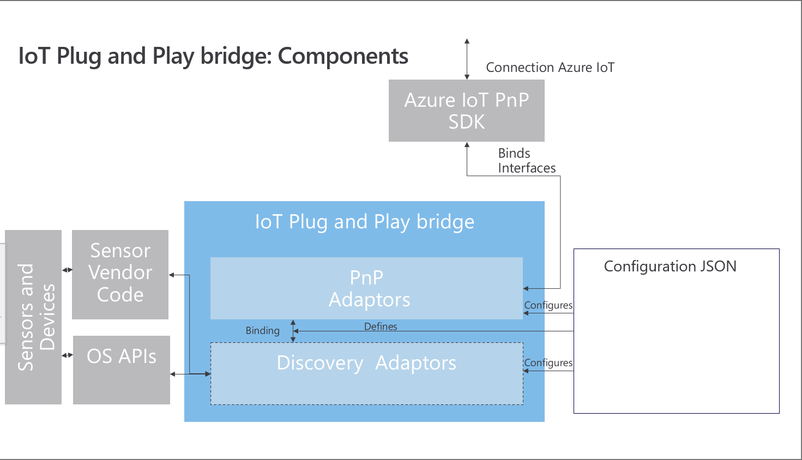

# Building, Deploying, and Extending the Azure IoT Plug and Play bridge 
This section describes the following: 
* [Azure IoT Plug and Play bridge Components](#Azure-IoT-Plug-and-Play-bridge-Components)
* [Extending IoT Plug and Play bridge: Authoring new Bridge Adapters](#Extending-IoT-Plug-and-Play-bridge-Authoring-new-Bridge-Adapters)
* [Building and Running the Azure IoT Plug and Play bridge](#Building-and-Running-the-Azure-IoT-Plug-and-Play-bridge)

To get started with a simple example, view the [Quickstart](./quickstart.md).

## Azure IoT Plug and Play bridge Components

### Discovery Adapter

A [discovery adapter](./docs/discovery_adapters.md) is a device watcher that is capable of reporting devices back to the Azure IoT Plug and Play Bridge (PnP Bridge) in the form of a json message. These messages are used by the bridge to match a device from the Azure IoT Plug and Play bridge configuration and call into a PnP adapter to publish a Azure IoT PnP interface.
The message format should conform to below template:

```JSON
{
  "identity": "<DiscoveryAdapterIdentity>",
  "match_parameters": {
    "<UserDefinedKey1>" : "<UserDefinedValue1>",
    "<UserDefinedKey2>" : "<UserDefinedValue2>"
  }
}
```
For devices that self describe Azure IoT PnP interface(s), the message above should contain "InterfaceId" in the root document object.

There are currently 6 discovery adapters in PnP Bridge:

* WindowPnPDiscovery: Reports a PnP device based on a device class provided as part of PnP Bridge configuration
* [CameraDiscovery](./src/adapters/src/Camera/readme.md): Reports a camera on Windows
* [SerialPnp](./../serialpnp/Readme.md): Reports a serialpnp device. This allows devices like MCUs to self describe Azure IoT PnP interfaces.
* [ModbusPnpDeviceDiscovery](./docs/modbus_adapters.md): Reports sensors connected via Modbus
* [BluetoothSensorPnPDiscovery](./docs/bluetooth_sensor_adapter.md): Reports detected BLE Bluetooth sensors 
* [MQTT_PnP](./docs/mqtt_adapter.md): Reports detected MQTT messages from a broker

Here's an example output of json message published by WindowPnPDiscovery adapter:

```JSON
{
  "identity": "windows-pnp-discovery",
  "match_parameters": {
    "hardware_id" : "USB\\VID_045E&PID_07CD"
  }
}
```

If there are any initial parameters that needs to be passed as part of the Discovery Adapter's StartDiscovery method, these parameters can be specified in PnP Bridge Configuration. For example, we want the WindowPnPDiscovery to report device that register USB device interface class.

```JSON
"discovery_adapters": {
    "parameters": [
      {
        "identity": "core-device-discovery",
        "device_interface_classes": [
          "A5DCBF10-6530-11D2-901F-00C04FB951ED"
        ]
      }
    ]
}
```

### PnP Adapter

A PnP Adapter implements the bindings of Azure IoT PnP interface. There are currently 6 PnP adapters in the Azure IoT Plug and Play bridge:

* CoreDeviceHealth: Implements basic device health interface
* [CameraPnP](./src/adapters/src/Camera/readme.md): Implements camera specific health interface
* [SerialPnp](../serialpnp/Readme.md): Implements interfaces associated with MCUs or other devices that are [SerialPnP protocol compliant](../serialpnp/Readme.md)
* [ModbusPnP](./docs/modbus_adapters.md): Implements modbus sensor interfaces
* [BluetoothSensorDeviceAdaptor](./docs/bluetooth_sensor_adapter.md): Implements BLE Bluetooth sensor interfaces
* [MQTT_PnP](./docs/mqtt_adapter.md): Implements an interface for MQTT messages from a broker
### Configuration file

IoT Plug and Play bridge uses a configuration file to get the IoT Hub connection settings and to configure devices for which PnP interfaces will be published. In the future this configuration could come from cloud.

The schema for the configuration file is located under:
[**src\pnpbridge\src\pnpbridge_config_schema.json**](./src/pnpbridge/src/pnpbridge_config_schema.json).

Use this with VS code while authoring a PnpBridge configuration file to get schema validation.

## Extending IoT Plug and Play bridge: Authoring new Bridge Adapters

To extend Azure IoT Plug and Play bridge in order to support new device discovery and implement new Azure IoT PnP interfaces, follow the steps below. All the API declarations are part of "PnpBridge.h". 

### Create a Discovery Adapter

  If an existing discovery adapter's message is sufficient to identify a device then you can skip implementing Discovery adapter. To implement a new Discovery adapter, implement the methods in the structure below, populate a static instance of the structure:

  ```C
    typedef struct _DISCOVERY_ADAPTER {
        // Identity of the Discovery Adapter
        const char* identity;

        // Discovery Adapter wide initialization callback
        DISCOVERYADAPTER_START_DISCOVERY startDiscovery;
        
        // Discovery Adapter wide shutdown callback
        DISCOVERYADAPTER_STOP_DISCOVERY stopDiscovery;
    } DISCOVERY_ADAPTER, *PDISCOVERY_ADAPTER;
  ```

  The API's above are described in discoveryadapter_api.h

### Create a PnP Adapter

  This adapter implements the Azure IoT PnP interface for a device. Following callbacks needs to be implemented:

  ```C
    typedef struct _PNP_ADAPTER {
        // Identity of the Pnp Adapter
        const char* Identity;

        // Discovery Adapter wide initialization callback 
        PNPADAPTER_PNP_INTERFACE_INITIALIZE initialize;

        // PnpBridge calls this when a matching device is found
        PNPADAPTER_BIND_PNP_INTERFACE createPnpInterface;

        // PnP Adapter wide shutdown callback
        PNPADAPTER_PNP_INTERFACE_SHUTDOWN shutdown;
    } PNP_ADAPTER, *PPNP_ADAPTER;
  ```

  The API's above are described in pnpadapter_api.h

  When a `Pnp Adapter` `createPnpInterface` callback is invoked, it should create a `PNP_INTERFACE_CLIENT_HANDLE` using the PnP SDK and call the PnpBridge's `PnpAdapterInterface_Create` API. An adapter can create multiple interfaces within a `createPnpInterface` callback. 

### Enabling new Adapters in the IoT Plug and Play bridge
Enable the adapters in PnP Bridge by adding a reference to these adapters in adapters/src/shared/adapter_manifest.c:

  ```C
    extern DISCOVERY_ADAPTER MyDiscoveryAdapter;
    PDISCOVERY_ADAPTER DISCOVERY_ADAPTER_MANIFEST[] = {
      .
      .
      &MyDiscoveryAdapter
    }

    extern PNP_ADAPTER MyPnpAdapter;
    PPNP_ADAPTER PNP_ADAPTER_MANIFEST[] = {
      .
      .
      &MyPnpAdapter
    }
  ```

The discovery adapter will be started automatically. To publish an Azure PnP interface add a configuration entry in config.json. In the below example, the PnpAdapter identity used is "my-pnp-adapter". The "component_name" below can be thought of as an identifier for a particular instance of an interface. 

  ```JSON
  "devices": [
      {
        "_comment": "MyDevice",
        "match_filters": {
          "match_type": "Exact",
          "match_parameters": {
            "my_custom_identity": "my-sample-device"
          }
        },
        "interface_id": "urn:contoso:com:mypnpinterface:1",
        "component_name":"MyComponent1",
        "pnp_parameters": {
          "identity": "my-pnp-adapter"
        }
      }
    ]
  ```

>Note: PnpBridge adapter callbacks are invoked in a sequential fashion. An adapter shouldn't block a callback since this will prevent PnpBridge from making forward progress.

### Sample Camera Adapter
The following [readme](./src/adapters/src/Camera/readme.md) provides details on a sample camera adapter that can be enabled with this preview.

## Building and Running the Azure IoT Plug and Play bridge

| Platform | Supported |
| :-----------: | :-----------: |
| Windows |  :heavy_check_mark: |
| Linux | :heavy_check_mark: |

### Prerequisites
To complete this section, you need to install the following software on your local machine:
* A development environment that supports compiling C++ such as: [Visual Studio (Community, Professional, or Enterprise)](https://visualstudio.microsoft.com/downloads/)- make sure that you include the NuGet package manager component and the Desktop Development with C++ workload when you install Visual Studio.
* [CMake](https://cmake.org/download/) - when you install CMake, select the option `Add CMake to the system PATH`.
* If you are building on Windows, you will also need to download Windows 17763 SDK: https://developer.microsoft.com/en-US/windows/downloads/windows-10-sdk
* To successfully complete the Modbus section of the guide, you will need to connect a Modbus sensor (such as a simple CO2 sensor) to the device running the bridge.

### Step 1: Get the required dependencies
After cloning the Azure PnP Bridge repo to your machine, open the "Developer Command Prompt for VS 2017" and navigate to the directory of the cloned repo:
```
%REPO_DIR%\> cd pnpbridge

%REPO_DIR%\pnpbridge\> git submodule update --init --recursive
```
>Note: If you run into issues with the git clone sub module update failing, this is a known issue with Windows file paths and git see: https://github.com/msysgit/git/pull/110 . You can try the following command to resolve the issue: `git config --system core.longpaths true`


### Step 2: Build the Azure IoT Plug and Play bridge (on Windows)

```
%REPO_DIR%\pnpbridge\> cd scripts\windows

%REPO_DIR%\pnpbridge\scripts\windows> build.cmd
```
To use visual studio, open the generated solution file:


```
%REPO_DIR%\pnpbridge\> cd cmake\pnpbridge_x86

%REPO_DIR%\pnpbridge\cmake\pnpbridge_x86> azure_iot_pnp_bridge.sln
```
Once you open the solution in Visual Studio, build the application. On the menu bar, choose "Build > Build Solution". This project used CMAKE for generating project files. Any modifications made to the project in visual studio might be lost if the appropriate CMAKE files are not updated.

### Step 2: Build the Azure IoT Plug and Play bridge (on Linux)

```
: /%REPO_DIR%/pnpbridge/ $ cd scripts/linux

: /%REPO_DIR%/pnpbridge/scripts/linux $ ./setup.sh

: /%REPO_DIR%/pnpbridge/scripts/linux $ ./build.sh
```

### Step 3: Setting up the Configuration JSON for Generic Sensors

Modify the folowing parameters under **pnp_bridge_parameters** node in    the config file  ([%REPO_DIR%\pnpbridge\cmake\pnpbridge_x86\src\pnpbridge\samples\console](./src/pnpbridge/src/pnpbridge_config_schema.json)):

  Using Connection string (Note: the symmetric_key must match the SAS key in the connection string):

  ```JSON
    {
      "connection_parameters": {
        "connection_type" : "connection_string",
        "connection_string" : "[CONNECTION STRING]",
        "device_capability_model_uri": "[To fill in]",
        "auth_parameters" : {
          "auth_type" : "symmetric_key",
        }
      }
    }
  }
  ```
  Or using DPS:

  ```JSON
  {
      "connection_parameters": {
        "connection_type" : "dps",
        "device_capability_model_uri": "[To fill in]",
        "auth_parameters" : {
          "auth_type" : "symmetric_key",
          "symmetric_key" : "[DEVICE KEY]"
        },
        "dps_parameters" : {
          "global_prov_uri" : "[GLOBAL PROVISIONING URI] - typically it is global.azure-devices-provisioning.net",
          "id_scope": "[IOT HUB ID SCOPE]",
          "device_id": "[DEVICE ID]"
        }
      }
    }
  }
  ```
  > Note: Refer to the [Azure IoT Central documentation on device connectivity](https://docs.microsoft.com/en-us/azure/iot-central/core/concepts-connectivity) for how to generate the id_scope, device_id, and symmetric_key for your device. The device_capability_model_uri is the "CapabilityModelId" that is listed for your device's Device Capability Model in Azure IoT Central.

In this example we further modified the configuration file.

### Step 4: Start the IoT Plug and Play bridge for Generic Sensors
Start PnpBridge by running it in a command prompt.

  ```
  %REPO_DIR%\pnpbridge\> cd cmake\pnpbridge_x86\src\pnpbridge\samples\console

  %REPO_DIR%\pnpbridge\cmake\pnpbridge_x86\src\pnpbridge\samples\console>    Debug\pnpbridge_bin.exe
  ```

  > Note: If you have either a built-in camera or a USB camera connected to your   PC running the PnpBridge, you can start an application that uses camera, such as the built-in "Camera" app.  Once you started running the Camera app, PnpBridge console output window will show the monitoring stats and the frame rate of the camera will be reported through Azure IoT PnP interface to Azure.

## Folder Structure

### /deps/azure-iot-sdk-c-pnp

Git submodules that contains Azure IoT C PNP SDK code

### /scripts

Build scripts

### /src/pnpbridge

Source code for PnpBridge core

### /src/adapters

Source code for various PnpBridge adapters     

# Support

For any questions raise an issue or contact - [pnpbridge@microsoft.com](mailto:pnpbridge@microsoft.com)
