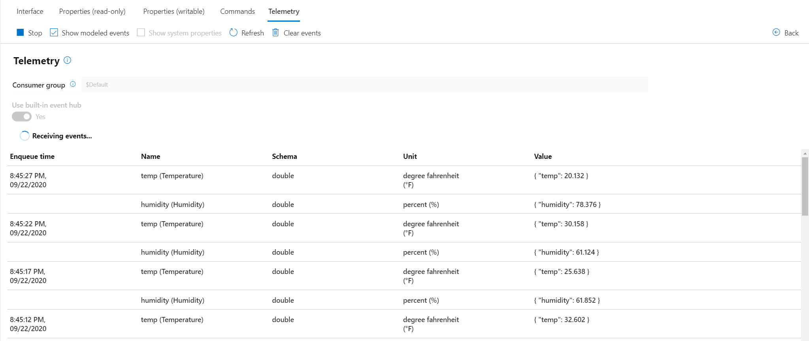

# How to connect an IoT Plug and Play bridge sample running on Linux or Windows to IoT Hub

This guide shows you how to build the IoT Plug and Play bridge's sample environmental adapter, connect it to your IoT hub, and use the Azure IoT explorer tool to view the telemetry it sends. The IoT Plug and Play bridge is written in C and includes the Azure IoT device SDK for C. By the end of this tutorial you should be able to run the IoT Plug and Play bridge and see it report telemetry in Azure IoT explorer:



## Prerequisites

You can run the sample in the guide on Windows or Linux. The shell commands in this how-to guide follow the Windows convention for path separators '`\`', if you're following along on Linux be sure to swap these separators for '`/`'.

### Azure IoT explorer

To interact with the sample device in the second part of this guide, you use the **Azure IoT explorer** tool. [Download and install the latest release of Azure IoT explorer](https://docs.microsoft.com/azure/iot-pnp/howto-use-iot-explorer) for your operating system.

## Prepare an IoT hub

You need an Azure IoT hub in your Azure subscription to complete the steps in this article. If you don't have an Azure subscription, create a [free account](https://azure.microsoft.com/free/?WT.mc_id=A261C142F) before you begin.

If you're using the Azure CLI locally, first sign in to your Azure subscription using `az login`. If you're running these commands in the Azure Cloud Shell, you're signed in automatically.

If you're using the Azure CLI locally, the `az` version should be **2.8.0** or later; the Azure Cloud Shell uses the latest version. Use the `az --version` command to check the version installed on your machine.

Run the following command to add the Microsoft Azure IoT Extension for Azure CLI to your instance:

```azurecli-interactive
az extension add --name azure-iot
```

If you don't already have an IoT hub to use, run the following commands to create a resource group and a free-tier IoT hub in your subscription. Replace `<YourIoTHubName>` with a hub name of your choice:

```azurecli-interactive
az group create --name my-pnp-resourcegroup \
    --location centralus
az iot hub create --name <YourIoTHubName> \
    --resource-group my-pnp-resourcegroup --sku F1
```

Run the following command to create the device identity in your IoT hub. Replace the `<YourIoTHubName>` and `<YourDeviceID>` placeholders with your own _IoT Hub name_ and a _device ID_ of your choice.

```azurecli-interactive
az iot hub device-identity create --hub-name <YourIoTHubName> --device-id <YourDeviceID>
```

Run the following command to get the _IoT Hub connection string_ for your hub. Make a note of this connection string, you use it later in this guide:

```azurecli-interactive
az iot hub show-connection-string --hub-name <YourIoTHubName> --output table
```

Run the following command to get the _device connection string_ for the device you added to the hub. Make a note of this connection string, you use it later in this guide:

```azurecli-interactive
az iot hub device-identity show-connection-string --hub-name <YourIoTHubName> --device-id <YourDeviceID> --output table
```

## Download and run the bridge

In this guide, you have two options to run the bridge. You can:

- Download a prebuilt executable and run it as described in this section.
- Download the source code and then [build and run the bridge](#build-and-run-the-bridge) as described in the following section.

To download and run the bridge:

1. Go to the IoT Plug and Play [releases page](https://github.com/Azure/iot-plug-and-play-bridge/releases).
1. Download the prebuilt executable for your operating system: **pnpbridge_bin.exe** for Windows, or **pnpbridge_bin** for Linux.
1. Download the sample [config.json](https://raw.githubusercontent.com/Azure/iot-plug-and-play-bridge/master/pnpbridge/src/adapters/samples/environmental_sensor/config.json) configuration file for the environmental sensor sample. Make sure that the configuration file is in the same folder as the executable.
1. Edit the *config.json* file:

    - Add the `connection-string` value that's the _device connection string_ you made a note of previously.
    - Add the `symmetric_key` value that's shared access key value from the _device connection string_.
    - Replace the `root_interface_model_id` value with `dtmi:com:example:PnpBridgeEnvironmentalSensor;1`.

    The first section of the *config.json* file now looks like the following snippet:

    ```json
    {
      "$schema": "../../../pnpbridge/src/pnpbridge_config_schema.json",
      "pnp_bridge_connection_parameters": {
        "connection_type" : "connection_string",
        "connection_string" : "HostName=youriothub.azure-devices.net;DeviceId=yourdevice;SharedAccessKey=TTrz8fR7ylHKt7DC/e/e2xocCa5VIcq5x9iQKxKFVa8=",
        "root_interface_model_id": "dtmi:com:example:PnpBridgeEnvironmentalSensor;1",
        "auth_parameters": {
            "auth_type": "symmetric_key",
            "symmetric_key": "TTrz8fR7ylHKt7DC/e/e2xocCa5VIcq5x9iQKxKFVa8="
        },
    ```

1. Run the executable in you command-line environment. The bridge generates output that looks like:

    ```output
    c:\temp\temp-bridge>dir
     Volume in drive C is OSDisk
     Volume Serial Number is 38F7-DA4A
    
     Directory of c:\temp\temp-bridge
    
    10/12/2020  12:24    <DIR>          .
    10/12/2020  12:24    <DIR>          ..
    08/12/2020  15:26             1,216 config.json
    10/12/2020  12:21         3,617,280 pnpbridge_bin.exe
                   2 File(s)      3,618,496 bytes
                   2 Dir(s)  12,999,147,520 bytes free
    
    c:\temp\temp-bridge>pnpbridge_bin.exe
    Info:
     -- Press Ctrl+C to stop PnpBridge
    
    Info: Using default configuration location
    Info: Starting Azure PnpBridge
    Info: Pnp Bridge is running as am IoT egde device.
    Info: Pnp Bridge creation succeeded.
    Info: Connection_type is [connection_string]
    Info: Tracing is disabled
    Info: WARNING: SharedAccessKey is included in connection string. Ignoring symmetric_key in config file.
    Info: IoT Edge Device configuration initialized successfully
    Info: Building Pnp Bridge Adapter Manager, Adapters & Components
    Info: Adapter with identity environment-sensor-sample-pnp-adapter does not have any associated global parameters. Proceeding with adapter creation.
    Info: Pnp Adapter with adapter ID environment-sensor-sample-pnp-adapter has been created.
    Info: Pnp Adapter Manager created successfully.
    Info: Pnp components created successfully.
    Info: Pnp components built in model successfully.
    Info: Connected to Azure IoT Hub
    Info: Environmental Sensor: Starting Pnp Component
    Info: IoTHub client call to _SendReportedState succeeded
    Info: Environmental Sensor Adapter:: Sending device information property to IoTHub. propertyName=state, propertyValue=true
    Info: Pnp components started successfully.
    ```

## Build and run the bridge

If you prefer to build the executable yourself, you can download the source code and build scripts.

Open a command prompt in a folder of your choice. Run the following command to clone the [IoT Plug and Play bridge](https://github.com/Azure/iot-plug-and-play-bridge) GitHub repository into this location:

```cmd
git clone https://github.com/Azure/iot-plug-and-play-bridge.git
```

After you clone the repository, update the submodules. The submodules include the Azure IoT SDK for C:

```cmd
cd iot-plug-and-play-bridge
git submodule update --init --recursive
```

Expect this operation to take several minutes to complete.

> TIP:
> If you run into issues with the git clone sub module update failing, this is a known issue with Windows file paths. You can try the following command to resolve the issue: `git config --system core.longpaths true`

The prerequisites for building the bridge differ by operating system:

### Windows

To build the IoT Plug and Play bridge on Windows, install the following software:

* [Visual Studio (Community, Professional, or Enterprise)](https://visualstudio.microsoft.com/downloads/) - make sure you include the **Desktop Development with C++** workload when you [install](/cpp/build/vscpp-step-0-installation?preserve-view=true&view=vs-2019) Visual Studio.
* [Git](https://git-scm.com/download/).
* [CMake](https://cmake.org/download/).

### Linux

This guide assumes you're using Ubuntu Linux. The steps in this guide were tested using Ubuntu 18.04.

To build the IoT Plug and Play bridge on Linux, install **GCC**, **Git**, **cmake**, and all the required dependencies using the `apt-get` command:

```sh
sudo apt-get update
sudo apt-get install -y git cmake build-essential curl libcurl4-openssl-dev libssl-dev uuid-dev
```

Verify the version of `cmake` is above **2.8.12** and the version of **GCC** is above **4.4.7**.

```sh
cmake --version
gcc --version
```

### Build the IoT Plug and Play bridge

Navigate to the *pnpbridge* folder in the repository directory.

For Windows run the following in a [Developer Command Prompt for Visual Studio](https://docs.microsoft.com/dotnet/framework/tools/developer-command-prompt-for-vs):

```cmd
cd scripts\windows
build.cmd
```

Similarly for Linux run the following:

```bash
cd scripts/linux
./setup.sh
./build.sh
```

> TIP:
> On Windows, you can open the solution generated by the cmake command in Visual Studio 2019. Open the *azure_iot_pnp_bridge.sln* project file in the cmake directory and set the *pnpbridge_bin* project as the startup project in the solution. You can now build the sample in Visual Studio and run it in debug mode.

### Edit the configuration file

You can learn more about config files in the [IoT Plug and Play bridge concepts document](https://docs.microsoft.com/azure/iot-pnp/concepts-iot-pnp-bridge).

Open the the *iot-plug-and-play-bridge\pnpbridge\src\adapters\samples\environmental_sensor\config.json* file in a text editor.

- Add the `connection-string` value that's the _device connection string_ you made a note of previously.
- Add the `symmetric_key` value that's shared access key value from the _device connection string_.
- Replace the `root_interface_model_id` value with `dtmi:com:example:PnpBridgeEnvironmentalSensor;1`.

The first section of the *config.json* file now looks like the following snippet:

```json
{
  "$schema": "../../../pnpbridge/src/pnpbridge_config_schema.json",
  "pnp_bridge_connection_parameters": {
    "connection_type" : "connection_string",
    "connection_string" : "HostName=youriothub.azure-devices.net;DeviceId=yourdevice;SharedAccessKey=TTrz8fR7ylHKt7DC/e/e2xocCa5VIcq5x9iQKxKFVa8=",
    "root_interface_model_id": "dtmi:com:example:PnpBridgeEnvironmentalSensor;1",
    "auth_parameters": {
        "auth_type": "symmetric_key",
        "symmetric_key": "TTrz8fR7ylHKt7DC/e/e2xocCa5VIcq5x9iQKxKFVa8="
    },
```

### Run the IoT Plug and Play bridge

Start the IoT Plug and Play bridge environmental sensor sample. The parameter is the path to `config.json` file you edited in the previous section:

```cmd
REM Windows
cd iot-plug-and-play-bridge\pnpbridge\cmake\pnpbridge_x86\src\pnpbridge\samples\console
Debug\pnpbridge_bin.exe ..\..\..\..\..\..\src\adapters\samples\environmental_sensor\config.json
```

The bridge generates output that looks like:

```output
c:\temp>cd iot-plug-and-play-bridge\pnpbridge\cmake\pnpbridge_x86\src\pnpbridge\samples\console

c:\temp\iot-plug-and-play-bridge\pnpbridge\cmake\pnpbridge_x86\src\pnpbridge\samples\console>Debug\pnpbridge_bin.exe ..\..\..\..\..\..\src\adapters\samples\environmental_sensor\config.json
Info:
 -- Press Ctrl+C to stop PnpBridge

Info: Using configuration from specified file path: ..\..\..\..\..\..\src\adapters\samples\environmental_sensor\config.json
Info: Starting Azure PnpBridge
Info: Pnp Bridge is running as am IoT egde device.
Info: Pnp Bridge creation succeeded.
Info: Connection_type is [connection_string]
Info: Tracing is disabled
Info: WARNING: SharedAccessKey is included in connection string. Ignoring symmetric_key in config file.
Info: IoT Edge Device configuration initialized successfully
Info: Building Pnp Bridge Adapter Manager, Adapters & Components
Info: Adapter with identity environment-sensor-sample-pnp-adapter does not have any associated global parameters. Proceeding with adapter creation.
Info: Pnp Adapter with adapter ID environment-sensor-sample-pnp-adapter has been created.
Info: Pnp Adapter Manager created successfully.
Info: Pnp components created successfully.
Info: Pnp components built in model successfully.
Info: Connected to Azure IoT Hub
Info: Environmental Sensor: Starting Pnp Component
Info: IoTHub client call to _SendReportedState succeeded
Info: Environmental Sensor Adapter:: Sending device information property to IoTHub. propertyName=state, propertyValue=true
Info: Pnp components started successfully.
Info: IoTHub client call to _SendEventAsync succeeded
Info: PnpBridge_PnpBridgeStateTelemetryCallback called, result=0, telemetry=PnpBridge configuration complete
Info: Processing property update for the device or module twin
Info: Environmental Sensor Adapter:: Successfully delivered telemetry message for <environmentalSensor>
```

Use the following commands to run the bridge on Linux:

```bash
cd iot-plug-and-play-bridge/pnpbridge/cmake/pnpbridge_x86/src/pnpbridge/samples/console
./pnpbridge_bin ../../../../../../src/adapters/samples/environmental_sensor/config.json
```

## Download the model files

You use Azure IoT Explorer later to view the device when it connects to your IoT hub. Azure IoT Explorer needs a local copy of the model file that matches the **Model ID** your device sends. The model file lets the IoT Explorer display the telemetry, properties, and commands that your device implements.

To download the models for Azure IoT explorer:

1. Create a folder called *models* on your local machine.
1. Save [EnvironmentalSensor.json](https://raw.githubusercontent.com/Azure/iot-plug-and-play-bridge/master/pnpbridge/docs/schemas/EnvironmentalSensor.json) to the *models* folder you created in the previous step.
1. If you open this model file in a text editor, you can see the the model defines a component with `dtmi:com:example:PnpBridgeEnvironmentalSensor;1` as its ID. This is the same model ID you used in the *config.json* file.

## Use Azure IoT explorer to validate the code

After the bridge starts, use the Azure IoT explorer tool to verify it's working. You can see the telemetry, properties, and commands defined in the `dtmi:com:example:PnpBridgeEnvironmentalSensor;1` model.

1. Open Azure IoT explorer.

1. On the **IoT hubs** page, if you haven't already added a connection to your IoT hub, select **+ Add connection**. Enter the connection string for the IoT hub you created previously and select **Save**.

1. On the **IoT Plug and Play Settings** page, select **+ Add > Local folder** and select the local *models* folder where you saved your model files.

1. On the **IoT hubs** page, click on the name of the hub you want to work with. You see a list of devices registered to the IoT hub.

1. Click on the **Device ID** of the device you created previously.

1. The menu on the left shows the different types of information available for the device.

1. Select **IoT Plug and Play components** to view the model information for your device.

1. You can view the different components of the device. The default component and any additional ones. Select a component to work with.

1. Select the **Telemetry** page and then select **Start** to view the telemetry data the device is sending for this component.

1. Select the **Properties (read-only)** page to view the read-only properties reported for this component.

1. Select the **Properties (writable)** page to view the writable properties you can update  for this component.

1. Select a property by it's **name**, enter a new value for it, and select **Update desired value**.

1. To see the new value show up  select the **Refresh** button.

1. Select the **Commands** page to view all the commands for this component.

1. Select the command you want to test set the parameter if any. Select **Send command** to call the command on the device. You can see your device respond to the command in the command prompt window where the sample code is running.

## Clean up resources

If you plan to continue exploring the IoT Plug and Play bridge, you can keep and reuse the resources you used in this guide. Otherwise, you can delete the resources you created in this guide to avoid additional charges.

You can delete both the hub and registered device at once by deleting the entire resource group with the following Azure CLI command. Don't use this command if these resources are sharing a resource group with other resources you want to keep.

```azurecli-interactive
az group delete --name <YourResourceGroupName>
```

To delete just the IoT hub, run the following command using Azure CLI:

```azurecli-interactive
az iot hub delete --name <YourIoTHubName>
```

To delete just the device identity you registered with your IoT hub, run the following command using Azure CLI:

```azurecli-interactive
az iot hub device-identity delete --hub-name <YourIoTHubName> --device-id <YourDeviceID>
```

You may also want to remove the cloned sample files from your development machine.


## Next steps

In this guide, you've learned how to run a sample IoT Plug and Play bridge, the suggested next steps are:

* [What is IoT Plug and Play bridge](https://docs.microsoft.com/azure/iot-pnp/concepts-iot-pnp-bridge)
* [Build, deploy, and extend IoT Plug and Play bridge](build_deploy.md)
