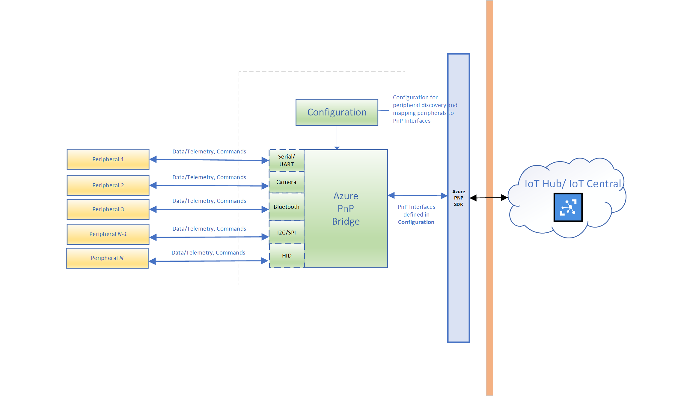

# IoT Plug and Play bridge

## Introduction

IoT Plug and Play bridge is the open source effort from Microsoft that connects the PC sensor and peripheral ecosystem to Azure. It builds on top of [IoT Plug and Play](https://www.aka.ms/iotpnp) so that with minimal to no code, developers can easily connect peripherals/sensors to Azure, remotely access their data, monitor them, and manage them. This allows developers to perform analytics and gain valuable insights on their IoT devices from either the edge or the cloud. The IoT Plug and Play bridge accomplishes this without requiring peripherals to have direct Azure connectivity, enabling them to use a Windows or Linux host as a gateway to Azure instead. Because of this, it is particularly well suited for connecting existing/constrained sensors to Azure.

IoT Plug and Play bridge can be deployed as a standalone executable on any IoT device, industrial PC, server, or gateway running Windows 10 or Linux. It can also be compiled into your application code. A simple configuration file tells the IoT Plug and Play bridge which sensors and peripherals should be exposed up to Azure. Once configured, the IoT Plug and Play bridge uses the [Azure IoT Hub Device C SDK](https://github.com/Azure/azure-iot-sdk-c) to create a single device client handle, corresponding to a top level interface with specific model ID (DTMI) and supported IoT Plug and Play (PnP) components as specified in the model,for the specified sensors and peripherals up to Azure.

IoT Plug and Play bridge can also be deployed as an IoT edge module running on any IoT edge device from an edge runtime running Linux. When the IoT Plug and Play bridge starts running as an edge module, it creates a single module client handle, corresponding to a top level interface with specific model ID (DTMI). Plug and Play Bridge adapter and IoT Plug and Play (PnP) components are not created until a property update for component and adapter related configuration (same as the JSON payload in the configuration file for IoT device) is received by the module. The JSON payload for the configuration, which tells the IoT Plug and Play bridge which sensors and peripherals should be exposed up to Azure, must be sent from the cloud to the module in the form of a desired property update for `PnpBridgeConfig`. The Plug and Play bridge will wait for this property update from the module twin to begin adapter and component configuration. Once configured, the IoT Plug and Play bridge uses the [Azure IoT Hub Module C SDK](https://docs.microsoft.com/en-us/azure/iot-hub/iot-c-sdk-ref/iothub-module-client-h) to begin device <-> cloud communication corresponding to the sensors and peripherals configured. 

Developers can then use existing Azure services and solution accelerators to receive data from and send commands to their sensors and peripherals.

## Get Started - Documentation

To get started with a simple example and learn about IoT Plug and Play bridge, view the [Reference Documentation](https://www.aka.ms/iot-pnp-bridge-docs). Follow [pnpbridge\Readme.md](./pnpbridge/ReadMe.md) to get started on building, deploying and extending the IoT Plug and Play bridge. 

## Peripherals and sensors supported by default

IoT Plug and Play bridge supports the following types of peripherals by default. Developers can extend the IoT Plug and Play bridge to support additional peripherals via the instructions in the [pnpbridge\Readme.md](./pnpbridge/ReadMe.md).

:heavy_check_mark: feature available  :heavy_plus_sign: feature planned but not supported  :heavy_minus_sign: no support planned  **N/A** - Not Applicable

|Peripheral (with Link to Adaptor Documentation)|Windows|Linux|
|---------|---------|---------|
|[Bluetooth LE](./pnpbridge/docs/bluetooth_sensor_adapter.md) |  :heavy_check_mark:    |  :heavy_minus_sign:       |
|[Cameras](./pnpbridge/src/adapters/src/Camera/readme.md) [1]   | :heavy_check_mark:        |:heavy_minus_sign:         |
|[Modbus](./pnpbridge/docs/modbus_adapters.md)     | :heavy_check_mark:        |  :heavy_check_mark:        |
|[MQTT](./pnpbridge/docs/mqtt_adapter.md)     | :heavy_check_mark:        |  :heavy_check_mark:        |
|[Serial](./serialpnp/Readme.md) [2]    |   :heavy_check_mark:      |     :heavy_check_mark:    |
|[Windows USB peripherals](./pnpbridge/docs/coredevicehealth_adapter.md)   |    :heavy_check_mark:     | **N/A**            |

[1]  All [cameras](./pnpbridge/src/adapters/src/Camera/readme.md) supported by Windows OS (Webcam, MIPI cameras and IP of RGB/IR/Depth cameras). To enable full support of ONVIF cameras, it is recomended to use 20H1 or later builds.

[2] For peripherals controlled by MCUs that are accessed over serial ports:

- Refer to the [SerialPnP documentation](./serialpnp/Readme.md) for information on how such devices should self-describe their interfaces to the IoT Plug and Play bridge

## Pre-Requisites

### OS Platform

The following OS platforms and versions are supported:

|Platform  |Supported Versions  |
|---------|---------|
|Windows 10     |     All Windows SKUs are supported. For example:<li>IoT Enterprise</li><li>Server</li><li>Desktop</li><li>IoT Core</li>   *For Camera health monitoring functionality, 20H1 or later build is recommended. All other functionality is available on all Windows 10 builds.*  |
|Linux     |Tested and Supported on Ubuntu 18.04, functionality on other distributions has not been tested.         |
||

### Hardware

- Any hardware platform capable of supporting the above OS SKUs and versions.
- Serial, USB, Bluetooth, and Camera peripherals and sensors are supported natively. The IoT Plug and Play Bridge can be extended to support any custom peripheral or sensor ([see peripherals section above](#peripherals-and-sensors-supported-by-default)).

### Development Environment

- A development environment that supports compiling C++ such as: [Visual Studio (Community, Professional, or Enterprise)](https://visualstudio.microsoft.com/downloads/)- make sure that you include the Desktop Development with C++ workload when you install Visual Studio.
- [CMake](https://cmake.org/download/) - when you install CMake, select the option `Add CMake to the system PATH`.
- If you are building on Windows, you will also need to download Windows 17763 SDK: [https://developer.microsoft.com/en-US/windows/downloads/windows-10-sdk](https://developer.microsoft.com/en-US/windows/downloads/windows-10-sdk)

- [Azure IoT Hub Device Client C SDK](https://github.com/Azure/azure-iot-sdk-c) and [Azure IoT Hub Module Client C SDK](https://docs.microsoft.com/en-us/azure/iot-hub/iot-c-sdk-ref/iothub-module-client-h) . The included build scripts in this repo will automatically clone the required Azure IoT C SDK for you.

### Azure IoT Products and Tools

- **Azure IoT Hub** - You'll need an [Azure IoT Hub](https://docs.microsoft.com/en-us/azure/iot-hub/) in your Azure subscription to connect your device to. If you don't have an Azure subscription, [create a free account](https://azure.microsoft.com/free/) before you begin. If you don't have an IoT Hub, [follow these instructions to create one](https://docs.microsoft.com/en-us/azure/iot-hub/iot-hub-create-using-cli).

> Note: IoT Plug and Play support is not included in basic-tier IoT Hubs.

- **[OPTIONAL]:** To interact with the your IoT Plug and Play device, you use the **Azure IoT explorer** tool. [Download and install the latest release of Azure IoT explorer](https://docs.microsoft.com/en-us/azure/iot-pnp/howto-use-iot-explorer) for your operating system.

## IoT Plug and Play bridge Architecture

## Contributing

We encourage community members to write and contribute their own IoT Plug and Play bridge adaptors.
This project has adopted the [Microsoft Open Source Code of Conduct](https://opensource.microsoft.com/codeofconduct/). For more information see the [Code of Conduct FAQ](https://opensource.microsoft.com/codeofconduct/faq/) or contact [opencode@microsoft.com](mailto:opencode@microsoft.com) with any additional questions or comments.

Microsoft collects performance and usage information which may be used to provide and improve Microsoft products and services and enhance your experience.  To learn more, review the [privacy statement](https://go.microsoft.com/fwlink/?LinkId=521839&clcid=0x409).  

### Contributing Code

We require pull-requests for code and documentation to be submitted against the `master` branch in order to review and run it in our gated build system. We try to maintain a high bar for code quality and maintainability, we request having tests associated with the code, and if necessary, additions/modifications to the requirement documents.

Please ensure you  review and sign the [Contribution License Agreement](https://cla.microsoft.com/) ([CLA](https://cla.microsoft.com/)). A friendly bot will remind you about it when you submit your pull-request. :)

## Support

For any questions, you can contact - [pnpbridge@microsoft.com](mailto:pnpbridge@microsoft.com). Found a bug? Please help us fix it by thoroughly documenting it and filing an issue on GitHub.
